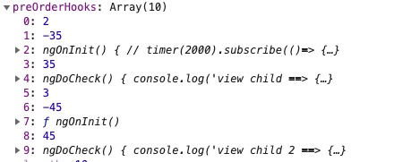

# 关注点

### 配置相关

```
1. aot(尽量移除jit)
2. treeshake
3. 懒加载、预加载(code split)
4. defer/async
5. 开启zip
6. enableProdMode
7. preserveWhitespaces

treeshake:
组件、指令、管道在编译时是能识别的，没用到的能自动treeshake
provider相关service无法自动treeshake, 写service时用provideIn，不要单独注入了（不用也识别不出来）

preserveWhitespaces:
删除空白字符，默认为preserveWhitespaces:false不保留
aot可以配置：
tsconfig.json
"angularCompilerOptions": {
"preserveWhitespaces": false,
}

jit:
bootstrapModule(AppModule, { preserveWhitespaces: false})
```

### 模板相关

1. ngFor

   > 使用trackBy

    <tr *ngFor="let item of items; trackBy: trackById;" class="h-12">
      <td>
        <span>{{ item.label }}</span>
      </td>
    </tr>
   
    代码是知道什么时候去执行的，用ngFor的话模块函数执行时就会执行一遍
    <tbody>
      <ng-container #itemsContainer></ng-container>
    </tbody>
    <ng-template #item let-item="item">
      <tr class="h-12">
        <td>
          <span>{{ item.label }}</span>
        </td>
      </tr>
    </ng-template>
   
    for (let n = start; n <= end; n++) {
        this.container.createEmbeddedView(this.template, {
          item: {
            label: Math.random()
          }
        });
    }
2. 模块表达示优化

   尽量选将需要的值在类里面计算好，这样在模块里就无须多次计算

  > 减少函数的调用
  >
  > 变更检测时运行模块函数会运行模块中的函数，变更检测后的值校验会再次运行对应的函数生成新的值并对比新老值

3. pipe  (己验证)
   > 异步pipe不会比较值，只要next就会执行
   >
   > 普通pipe只要有变更检测就会执行
   >
   > ngxs的translate pipe不是pure pipe, 它用取值时用选返回一个observable，然后subscribe（估计是同步的）然后在值的回调方法里面markForCheck(如果组件是onPush这样会不会倒致父级更新？)，虽然tranlate不是pure的，段是它在内部做了translate方法内部做了cached，在取值之前会先对比，但感觉还是不如pure

   ```
   使用pure pipe(pure pipe在执行前会和之前的值做比较，如果没有变化就直接用旧的值):
   @Pipe({
       name: "util",
       pure: true
   })
   
   
   异步pipe:
   对于普通的observable，跟同步pipe区别不大
   对于异步的observable，监听到数据后会更新值，tick触发时直接拿更新后的值
   ```

3. 作为参数的模块尽量作context传参

   ```
   下面例子中的模板同时使用了app与lib中的绑定，name或greeting更新都会倒致对应的更新，尽量将更新点集中在一处
   @Component({
     selector: 'lib-comp',
     template: `
       LibComp: {{greeting}}!
       <ng-container
           [ngTemplateOutlet]="template"
           [ngTemplateOutletContext]="{$implicit: greeting}">
       </ng-container>
     `
   })
   class LibComp {
     @Input()
     template: TemplateRef;
     greeting:string = "Hello";
   }
   
   @Component({
     template: `
       AppComp: {{name}}!
       <ng-template #myTmpl let-greeting>
         {{greeting}} {{name}}!
       </ng-template>
       <lib-comp [template]="myTmpl"></lib-comp>
     `
   })
   class AppComp {
     name: string = "world";
   }
   ```

4. 静态内容cache (将公用模板统一query出来保存并调用)

### 变更检测相关

> 异步操作是tick的源头
>
> micro task, macro task, event task
>
> 当有task执行完成且ngZon.onMicroTaskEmpty为空时就会触发tick
>
> 性能优化的关键点在于：减少tick次数、降低DC的范围
>
> 在requestAnimationFrame里面执行tick函数，最新angular己经使用上了


1. 性能监测工具（enableDebugTools)

   > ng.profiler.timeChangeDetection({record: true})可以触发变更检测，并记录平均每次tick的时间
   >
   > 通过对ngZon.onMicroTaskEmpty的监听来记录tick次数
   >
   > 能过组件本身的doCheck来记录组件的render次数

2. 异步请求

   > 每个异步请求都会倒致一次新的tick
   >
   > 批量操作请移到runOutsideAngular内部

   ```
   多个请求时async await会比forkJoin多一次tick，await最张会转成Promise, Promise会倒致一次tick
   rxjs的toPromise同async await的效果是一样的
   ```

3. onPush & markForCheck & changeDefects & detach & retach

   > immutable

   > markForCheck是否会导致父级更新？比如父级onPush，input未更新，那么子级markForCheck时父级是否进行更新？
   >
   > changeDefects是否是只更新当前组件及子组件？

   ```
   onPush触发组件更新的场景(ngDoCheck触发并不表示组件就会更新，不触发组件一定不会更新)：
   1. 输入属情（input ）发生变化 
   2. 事件（如click事件会触发组件及其父组件的更新）
   事件函数返回false就会自动preventDefault
   下面组件全是onPush
   view parent
   	view child 1
   	view child 2
   	content child
   view child click时ngDoCheck顺序: app -> parent -> content -> view 1 -> view 2
   content child click时ngDoCheck顺序： app -> parent -> content 并不会倒致view的dc
   在parent外部直接调用applicationRef.tick()不会倒致任何ngDoCheck触发
   在parent内部调用applicationRef.tick会倒致app的ngDoCheck触发
   
   parent.changeDefector.markForCheck()
   parent.applicationRef.tick()
   先markForCheck然后时ngDoCheck顺序: app -> parent -> content -> view 1 -> view 2，可见父组件更新时子组件会被检测是否更新
   
   事件触发时会将当前view及父组全部置为dirty:
   事件相关函数：wrapListenerIn_markDirtyAndPreventDefault => markViewDirty(markForCheck就是直接调用了markViewDirty)
   function markViewDirty(lView) {
       while (lView) {
           lView[FLAGS] |= 64 /* Dirty */;
           const parent = getLViewParent(lView);
           // Stop traversing up as soon as you find a root view that wasn't attached to any container
           if (isRootView(lView) && !parent) {
               return lView;
           }
           // continue otherwise
           lView = parent;
       }
       return null;
   }
   
   3. 手动调用changeDefects
   4. 调用markForCheck后在下一次tick时更新组件
   
   
   ```

   如下图是parent-view调用executeInitAndCheckHooks执行回调时对应的hooks，前面的init与check是view-child的，后面的是view-child2的,可见ngOnInit与ngDoCheck都是注册到父级组件并调用的

   

4. ngxs注册多个监听时，只更新一处是否会倒致多处监听触发？(己验证)

   > 内部使用了runOutsideAngular来优化性能

   > ngxs dispatch时会判断当前是否在angular zone内(比如由click触发执行的dispatch，即dispatch后会触发tick)，如果是则用runOutsideAngular的方式来dispatch，如果不在angular zone内部（如通过引用直接在console里面调用方法）就直接dispatch。当dispatch结束时同样会判断是否在angular zone内部，如果是在内部，则直接调用next，如果不在angular zone内部就调用ngzone.run(func) func只是用来调用next，而ngzone会触发tick.
   >
   > 不管用那种方式，tick只会触发一次

   > 注意：dispatch传数组或调用多次dispatch的结果是一样的，因为dispatch在angular zone上下文内运行时不会触发tick
   >

   ```
   select方法在使用时最好使用@Selector定义好的函数，这样会缓存，否则只要有变化就触发
   //下面的写法在每次有dispatch	action时都会触发
   this.store.select(state => state).subscibe(state => console.log('=====>', state))
   
   //下面的写法只有corpType发生变化时才触发临听
   @Select(CorpInfoState.companyType) companyType$: Observable<number>
   corpType$.subscribe(companyType => console.log('=======>', companyType))
   
   this.store.select(CorpInfoState.corpInfo)等效于下面的：
   @Select(CorpInfoState.corpInfo) corpInfo$: Observable<number>
   corpType$.subscribe(corpInfo => console.log('=======>', corpInfo))
   
   dispatch companyType时companyType及其父对象corpInfo都变了，所以两个都有触发
   
   dispatch corpType时只有父对象corpInfo变了，所以只触发corpInfo的监听
   dispatch accountType时都没有变化，一个监听都不触发
   ```

5. form相关

   ```
   1. 与form指令绑写的input, textarea监听的是input事件，输入即触发，优化成onChange时触发能减少大量tick（或者能根据输入参数判断在input或change时触发）
   2. 存在多个监听时，能否做到只有当前值修改了才触发（默认一处修改全部触发）
   ```

### 编码优化

1. 事件代理

   > angular没有事件代理，事件直接注册在对应的DOM元素上，列表中涉及事件操作时最好多事件代理

2. 虚拟滚动

3. 复杂计算缓存

4. webworker

  > 费时计算webworker

### 升级NgZone

> Angular 8里面的NgZone需要升级, ngzone触发tick需要requestAnimationFrame之类的优化（最新版angular己具备对应优化）

```
angular 8中事件发生后就会执行tick，多个事件就会tick多次。自定义tick处理，使用requestAnimationFrame来触发tick,这样可以合并一些tick
将最新的ngzone实现拿过来，并在启动时进行替换

(window as any).__Zone_disable_requestAnimationFrame = true; //禁止调用requestAnimationFrame时触发tick

platformBrowserDynamic().bootstrapModule(AppModule, {
  ngZone: Zone.current.fork({
    name: 'angular'
  })
})

function delayChangeDetectionForEvents(zone: NgZonePrivate) {
  if (zone.lastRequestAnimationFrameId !== -1) {
    return;
  }
  zone.lastRequestAnimationFrameId = zone.nativeRequestAnimationFrame.call(global, () => {
    if (!zone.fakeTopEventTask) {
      zone.fakeTopEventTask = Zone.root.scheduleEventTask('fakeTopEventTask', () => {
        zone.lastRequestAnimationFrameId = -1;
        updateMicroTaskStatus(zone);
        checkStable(zone);
      }, undefined, () => {}, () => {});
    }
    zone.fakeTopEventTask.invoke();
  });
  updateMicroTaskStatus(zone);
}

unction forkInnerZoneWithAngularBehavior(zone: NgZonePrivate) {
  const delayChangeDetectionForEventsDelegate = () => {
    delayChangeDetectionForEvents(zone);
  };
  // shouldCoalesceEventChangeDetection属性要为true，启动合并变更检测事件
  const maybeDelayChangeDetection = !!zone.shouldCoalesceEventChangeDetection &&
      zone.nativeRequestAnimationFrame && delayChangeDetectionForEventsDelegate;
  zone._inner = zone._inner.fork({
    name: 'angular',
    properties:
        <any>{'isAngularZone': true, 'maybeDelayChangeDetection': maybeDelayChangeDetection},
    onInvokeTask:
        (delegate: ZoneDelegate, current: Zone, target: Zone, task: Task, applyThis: any,
         applyArgs: any): any => {
          try {
            onEnter(zone);
            return delegate.invokeTask(target, task, applyThis, applyArgs);
          } finally {
            if (maybeDelayChangeDetection && task.type === 'eventTask') {
              maybeDelayChangeDetection();
            }
            onLeave(zone);
          }
        }

```

### 个人注意项

1. 写组件时注册组件是否被init了多次()

2. router改变时会至少触发两次tick

   > 目前存在页面（包含子组件），子组件直接在父组件内显示（没通过route-outlet控制）而在url上有区分。这种现像要避免，不需要router的可以将它去掉，需的话就用route-outlet控制

   ```
    两次事件：
   1. popstate/hashChange
   2. setTimeout
   ```

